# Important Points of KT

title: Important Points of KT  
categories: study in Unimelb

tags:  
- study  
- Unimelb  
- knowledge technology  
- review  

---

***Just for self-review, this document is not official or prefect. If there is any error, please tell me through the Issues in GitHub***

---

**Introduction to Knowledge Technology**

*Difference of data, information and knowledge*
>Data: measurements (bit patterns for computers)  
Information: processed data; patterns that are satisfied for given data  
Knowledge: information interpretted with respect to a user's context to extend human understanding in a given area (where we have data)

*Difinition of knowledge tasks and concrete tasks*
>Concrete tasks: mechanically processing data to an unambiguous solution; limited contribution to human understanding  
Knowledge tasks: data is unreliable or the outcome is ill-defined(usually both); computers mediate between the user an the data, where context (for the user) is critical; enhance human understanding.  

*Difinition of structured data, unstructured data and semi-structured data*
>Structured data: conforms to a schema, e.g. database  
Unstructured data: data without regular decomposable structure, e.g. plain text  
Semi-structured data: data which corresponds in part to a schema, but irregular or incomplete or rapidly changing; some important information is unavailable even with the schema.  
In practice, all data is semi-structured.

*Supervised learning*
>Classification: predicting a discrete class  
Regression: predicting a numeric quantity  

*Unsupervised learning*
>Association: detecting associations between features  
Information organisation; Clustering: grouping similar instances into clusters  
Reinforcement learning  
Recommender systems  
Anomaly/outlier detection  

*Some metacharacter in regular expressions*
>{ } [ ] ( ) ^ $ . | * + ? $ \

---
**Similarity and Probability**  

*TF-IDF*  

>, the number of terms contained in document d  
>, the frequency of term t in document d  
>, the average number of terms contained in a document  
>, the number of documents in the collection  
>, the number of documents containing term t  
>, the total number of occurrences of t acroses all documents  
>, the number of indexed terms in the collection  
>

*Entropy*
>

---
**Approximate Matching (not important)**

>Neighbourhood  
>Edit Distance  
>N-Gram Distance  
>Soundex  
>Accuracy
>Precision
>Recall

---
**Information Retrieval**

*Definition of IR*
>IR is "the subfield of computer science that deals with storage and retreval of documents"

*the commonest mode of information seeking*
>Issue an initial query  
>Scan a list of suggested answers  
>Follow links to specific documents  
>Refine or modify the query  
>Use advanced querying features

*different types of "informational needs"*
>Requests for information, e.g. "global warming"  
>Factoid questions, e.g. "what is the melting point of lead"  
>Topic tracking, e.g. "what is the history of this news story"  
>Navigational, e.g. "University of Melbourne home page"  
>Service or transactional, e.g. "Mac powerbook"
>Geospatial, e.g. "Carlton restaurant"

*Definition of Relevance*
>A document is relevant if it contains knowledge that helps the user to resolve the information need

* One example of Boolean querying (do some questions)*
>diabets AND((NOT risk) OR juvenile) == 110 AND((NOT 011) OR 100) = 100

*features of Boolean querying*
>repeatable, auditable, and contollable.  
>no ranking and no control over result set size  
>difficult to incorporate useful heuristics

*Difinition of rank*
>The more similar or likely a document is, relative to the other documents in the collection, the higher its rank is.

*TF-IDF (do some questions)*
>same to similarity

*Evaluation Metrics for IR*
>Accuracy(not a good choice)  
>Confusion matrix  
>Precision  
>Recall  
>Precision at k  
>Average Precision: sensitive to entire ranking: changing a single rank will change final score (facilitates failure analysis), stable: a small change in ranking makes a relatively small change in socre. has both precision and recall-oriented factors. but less easily interpreted  
>For many queries: Mean Average Precision  

---
**Web search**

*Elements of a web search engine*
>Crawling: the data to be searched needs to be gathered from the web  
>Parsing: the data then needs to be translated into a canonical form  
>Indexing: data structures must be built to allow search to take place efficiently  
>Querying: the data structures must be processed in response to queries  

*More practical add-on*
>Snippet generation  
>As-you-type quering  
>Query correction  
>Answer consolidation  
>Info boxes  

**Crawl**  

*Crawling*
>Before a document can be queried, the search engine must know that it exists  
>Crawlers(spiders, robots, or bots) attempt to vist every page of interest and retrieve them from processing and indexing  

*Challenges of crawling*
> Basic: there is no central index of URLs of interest  
> Some websites return the same content as a new URL at each visit  
> Some pages never return status 'done' on access  
> Some websites are not intended to be crawled  
> Much web content is generated on-the-fly from databases, which can be costly for the content provider, so excessive numbers of visits to a site are unwelcome.  
> Some content has a short lifespan  

*Assumption and Corollaray of crawling*
>if a web page is of interest, there will be a link to it from anohter page.  
>given a sufficiently rich set of starting points, every interesting sit on the web will be reached eventually.

*In priciple, crawls*
>1. Create a prioritised list L of URLs to visit, and a list V of URLs that have been visited and when.  
>2. Repeat forever:  
>>1. Choose a URL u from L and fetch the page p(u) at location u  
>>2. Parse and index p(u), and extract URLs {u1} from p(u)  
>>3. Add u to V and remove it from L. Add {u1} -V to L.
>>4. Process V to move expired or 'old' URLs to L.  
>
>In practice, page processing is much faster than URL resolution, so numerous streams of pages should be processed simultaneously.

*Features of L*
>Every page is visited eventually  
>Synonym URLs are disregarded  
>Significant or dynamic pages are visited sufficiently frequently  
>The crawler isn't cycling indefinitely in a single web sit

**Parse**  

*Parsing*
>the words in the document are extracted, then added to a data structure that records which documents contain which words.  
>First step: determining the format of the page  
>Parses should be robust and flexible  
>scraping: only retain some components of the page  

*Tokenisation*
>The aim of parsing is to reduce a web page, or a query to a sequence of tokens.  
>Canonicalisation: any indexing process that relies on fact extraction may need information in a canonical form.  

*Stemming*
>The most siginificant form of canonicalisation is arguably  
>This are an attempt to undo the processes that lead to word formation.  
>Stemming is the process of stripping away affixes
>It can be challenging, because every word has a different set of legal suffixes.  

*Zoning*
>Parsers consider issues such as font size, to detetmine which text is most prominent on the page and thus generate further zones.
>Some web search engines favour pages that have the query terms in titles.

**Index**

*Indexing*
>Fast query evaluation makes use of an index: a data structure that maps terms to the documents that contain them

*inverted index (do questions)*
>The only practical index structure for text query evaluation is the inverted index: a collection of lists, one perterm, recording the identifiers of the documents containing that term.  
>An inverted index can be seen as the transposition of document-term frequency matrix accessed by (d,t) pairs into one accessd by (t,d) pairs.

**Query**

*Boolean querying using a TDM*
>Fetch the inverted list for each query term   
>Use intersection of lists to resolve AND    
>Use union of lists to resolve OR  
>Take the complement of a list to resolve NOT  
>Ignore within-document frequencies  
>Start from the shorter to longer  

*Ranked Querying*
>TF-IDF

*Ways to reduce the cost of accumulators*
>Limit the number of accumulators  
>Create a threshold S to remove all accumulators which are smaller than S  

*Query costs*
>Disk space: for the index, at 40% of the size of the data(with unstemmed terms, the index can be around 80% of the size of the data)  
>Memory space: for accumulators, for the vocabulary, and for caching of previous results  
>CPU time: for processing iverted lists and updating accumulators  
>Disk traffic: to fetch inverted lists  
>By judicious use of compression and careful pruning, all of these costs can be dramatically reduced compared to this first inplementaion. The gains are so great that it makes no sense to implement without some use of compression

**add-ons**  

*Phrase queries*
>Phrase queries: use phrase as a term to determine adjacency  
>1.Process queries as bag-of-words, so that the terms can occur anywhere in matching documents, then post-process to eliminate false matches.  
>2.Add word positions to the index entries, so the location of each word in each document can be used during query evaluation.    
>Use some form of phrase index or word-oair index so that they can be directly indentified without using the inverted index

*Link analysis*
>In web search, a strong piece of evidence for a page's importance is given by links, in particular how many other pages have links to this page.

*Pagerank*
>Each page has the same probability of being the start point for the random walk.  
>For both teleports and traversal of outgoing links, all (relevant) pages have an equal probability of being visited

*A high-performance web search engine*
>Note which pages people acually visit by counting click-throughs.  
>Manually alter the behavior of common queries  
>Cache the answers to common queries  
>Index selected phrases  
>Divide the collection among multiple servers, each of which has an index of its documents. Then have multiple collections of identical servers  
>Have separate servers for crawling and index construction  
>Accept feeds from dynamic data providers such as booksellers, newspapers, and microblogging sites.  
>Integrate diverse data resources, such as maps and directories.  

---

**Introduction to Data Mining and Machine Learnig**

*Importance of problem of Data*
>Current computational methods cannot handle magnitude and dimensionlity of the data  
>Decision makers and scientists need techniques to help form hypotheses and make evidence based decisions

*Data Mining*
> Extracting: implicit, previously unknown and protentially useful  
> Information from data: needed: programs that detect patterns and regularities in the data

*Difinition of Machine learning*
>Algorithms for acquiring structural descriptions from examples: 
>Structural descriptions represent patterns explicitly  
>Can be used to predict outcome in new situation  
>Can be used to understand and explain how prediction is derived

*Supervised learning*
>Teach the computer how to do something, then let it use its new-found knowledge to do it  
>Labeled data: for given inputs, provide the expected output  
>Infer a function mapping from inputs to outputs  

*Unsupervised learning*  
>Let the computer learn how to do something  
>Determine structure an patterns in data  
>Unlabeled data: Don't give the computer "the answer"  

*Distinctions between Data Mining and Machine Learning*  
> Data mining is primarily about discovering something hidden in your data, that you did not know before, as "new" as possible. Knowledge obtained from data.  
> Machine learnig emphasises algorithms used to generalise existing knowledge to new data, as accurately as possible. Techniques used to learn from data.  
> Data mining applications typically use a lot of machine learning techniques. For example a pattern in a data set that is useful for generalisation might represent new knowledge

*Some basic Machine Learning concepts*
> The input to a machine learning system consists of instances, attributes and concepts

*Attributes*
>nominal: distinct symbols, also called categorical, enumerated, or discrete, including boolean  
>ordinal: an explicit order is imposed on the values, distinction between nominal and ordinal not always clear  
>continuous: numeric
  
---

**Clustering**

*Concepts of Clustering*
>Clustering is unsupervised  
>The class of an example is not known  
>Finding groups of items that are similar  
>Success often measured subjectively  
>Applications in pattern recognition, spatial dataanalysis, medical diagnosis  

*Basic conrasts*  
>Exclusive vs overlapping  
>Deterministic vs probabilistic
>Hierarchical vs partitioning  
>Partial vs complete  
>Heterogenous vs homogenous  
>Incremental ve batch  

*Desiderate*  
>Scalability; high dimensionality  
>Ability to deal with different types of attributes  
>Discovery of clusters with arbitrary shape  
>Able to deal with noise and outliers  
>Insensitive to order of input records  

*Unsupervised Evaluation*  
>Measures the goodness of a clustering structure without respect to external information. Includes measures of cluster cohesion (compactness, tghtness), and measures of cluster separation (isolation,distinctiveness).  

*Supervised Evaluation*  
>Measures the extend to which the clustering structure discovered by a clustering algorithm matches some external structure. For instance, entropy can measure how well cluster labes match externally supplied class labels  

*Relative and most common mesasure*  
>Compares different clusterings or clusters
> SUm of Squared Error(SSE) or Scatter (not understand)

*k-means Clustering*
>Select k points to act as seed cluster centroids  
>Repeat  
>Assign each instance to the cluster with the nearest centroid  
>Recompute the centroid of each cluster  
>until the centroids don't change  

*details*
>Initial centroids are often chosen randomly: Clusters produced vary from one run to another  
>The centroid is the mean of the points in the cluster  
>'Nearest' is based on proximity/similarity/etc. metric  
>K-means will coverage for common similarity measures
>Most of the convergence happens in the first few iterations.  
>Often the stopping condition is changed to 'untile relatively few points change clusters'

*Strengths*
>relatively efficient  
>can be extended to hierarchical clustering  

*Weaknesses*
>tends to converge to local minimum; sensitive to seed instances  
>need to specify k in advance  
>not able to handle non-convex cluster, or clusters of different densities or sizes.
>"mean" ill-defined for nominal or categorical attributes  
>may not work well when the data contains outliers

*Hierarchical Clustering (do questions)*
>Bottom-up: start with single-instance clusters, at each step, join the two closest clusters  
>Top-down: start with one universal cluster, find two partitioning clusters, proceed recursively on each subset  
>In contrast to k-means clustering, hierarchical clustering only requires a measure of similarity between groups of data points  

*proximity matrix*
> Single link: Minimum distance between any two points in the two clusters  
> Complete linkL maximum distance between any two points in the two clusters  
> Group average: average distance between all points

---

**Evaluation for classifications**

*Tensions in classifications*  
>Generalisation: how well does the classifier generalise from the specifics of the training examples to predict the target function?  
>Overfitting: has the classifier tuned itself to the idiosyncracies of the training data rather than learning its generalisable properties?  
>Consistency: is the classifier able to flawlessly predict the class of all training instances?

*Generalisation problem*  
>Under-fitting: model not expressive enough to capture patterns in the data.
>Over-fitting: model too complicated; capture noise in the data
>Appropriate-fitting model captures essential patterns in the data  

*Metrics*
>Confusion matrix  
>Accuracy: ACC  
>Error: ER = 1- ACC  
>ERR = (ER0 - ER)/ER0, ER0 is the baseline 
>Precision = TP / (TP+FP)
>Recall = TP / (TP+FN)
>Specificity: TN / (TN+ FP)  recall for negative value
>micro-ave: all
>macro-ave: mean

*F-score*
>In applications where we make individual decisions for each data point rather than generating a monolithic ranking, F-score gives us an overall picture of system performance:
>  
>beta depends on how much we care about false negatives ve false positives

*Receiver Operating Characteristic(ROC) and Area Under the Curve(AUC)*  
>A plot illustrating the performance of a classifier as its discrimination threshold is varied  
>Plotted in terms of True Positive Rate ve False Positive rate  
>The best possible prediction method would yield a poin in the under left corner or coordinate (0,1) pf the RPC space, representing 100% sensitivity (no false negatives) and 100% specificity (no false positives)
>AUC: equal to the probability that a classifier will rank a randomly chosen positive instance higher than a randomly chosen negative one

*Bias and Variance*
>Bias of a classifier is the average distance between the expected value and the estimated value  
>variance of a classifier is the standard deviation between the estimated value and the average estimated value  
>variance measures how inconsistant the decisions are, not whether they are correct or incorrect.  
>The noise in a dataset is the inherent variability of the training data  
>In evaluation, we aim to minimise classifier bias and variance  

*Hold out*  
>Train a classifier over a fixed training dataset, and evaluate it over a fixed held-out dataset  
>Pros: simple to work with, high reproducibility  
>Cons: trade-off between more training and more test data Representativeness of training and test data

*Random Subsampling*  
>Perform holdout over iterations, randomly selecting the training and test data (maintaining a fixed size for each dataset) on each iteration  
>Evaluated by taking the average across the iterations  
>Pro: reduction in variance and bias over "holdout" method  
>Con: reproducability

*Leave-one-out*  
>Pros: There is no sampling bias in evaluating the system and the results will be unique and repeatable  
>The method also generally gives higher accuracy values as nearly all (N-1) points are used in training.  
>Cons: It is infeasible if we have large data set and the training is itself very expensive. 

*M-fold Cross-Validation*  
>M equal size partitions  
>each for test other M-1 for training
>Pros: We need to train the system only M times unlike Leave-One-Out which requires training N times.  
>We can measure the stability of the system across different training/test combinations  
>Cons: There can be a bias in evaluateing the system due to sampling, how data is distributed among the M partitions  
>The results will be unique unless we always partition the data identically. One solution is repeat the M Fold Cross Validation by randomly shuffling the data M/2 times  
>The results will give slightly lower accuracy values as only (M-1)/M is used for training  
>For small data sets it is not always possible to partition the data propperly such that each partition represents tha data IID(Identically Independently Distributed)  

*Baselines vs Benchmarks*  
>Baseline = naive method which we would expect any reasonably well-developed method to better  
>Benchmark = established rival technique which we are pitching our method against  
>"Baseline" often used as umbrella term for both meanings  

*Random Baseline*
>1: randomly assign a class to each test instance(unsupervised)
>2:randomly assign a class to each test instance, weighting the class assignment according to P(Ck)  

*Zero-R*
>Method: classify all instances according to the most common class in the training data  
>The most commonly used baseline in machine learning  
>Inappropriate if the majoirity class is FALSE and the learning task is to identify needles in the haystack

*One-R*  
>Method: create a "decision stump" for each attribute, with branches for each value, and populate the leaf with the mojority class at that leaf; select the decision stump which leads to the lowest error rate over the training data  
>Pons:simple to understand and implement, simple to comprehend, surprisingly good results    
>Cons: unable to capture attribute interactions, bias towards high-arity attributes

---

**Classification**  

*Difinition*
>Classification involves predicting a discrete class or classes.  
>supervised: apre-classified training instances 

*Linear regression*  
>Linear regression cpatures a relationship between two variables or attributes  
>It makes the assumption that there is a linear relationship between the two variables  
>Regression can be applied when all variables/attributes are real numbers  

*k-NN*
>1-NN: Classify the test input according to the class of the closest training instance  
>k-NN: Classify the test input according to the majority class of the k nearest training instances  
>weighted k-NN: Classify the test input according to the weighted accumulative class of the k nearst training instances, where weights are based on similarity of the input to each of the k neighbours  
>offset-weighted k-NN: Classify the test input according to the weighted accumulative class of the k nearst training instances, where weights are based on similarity of the input to each of the k neighbours, factoring in an offset to indicate the prior expectation of as test input being classified as being a member of that class  
>brute-force for large data is not feasible  
>tree-based data structures.  
>Pros: Simple, can handle arbitrarily many classes  
>Cons: useful distance function, voting function, expensive, lazy learner, prone to bias, arbitray k value  

*Naive Bayes (do questions)*
>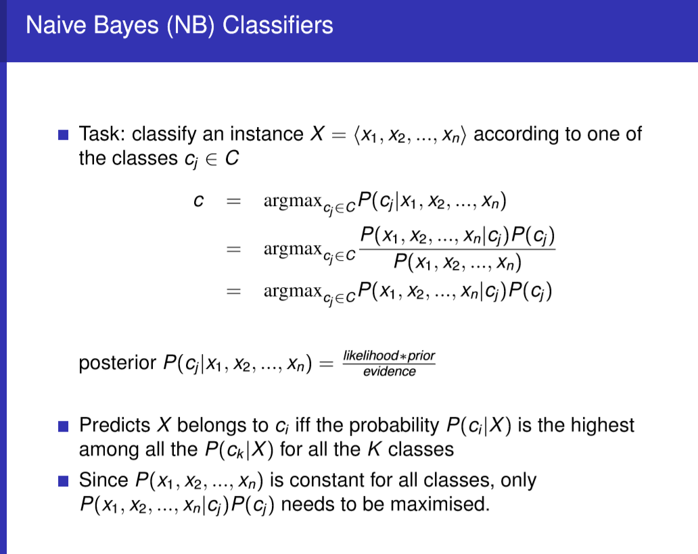 
>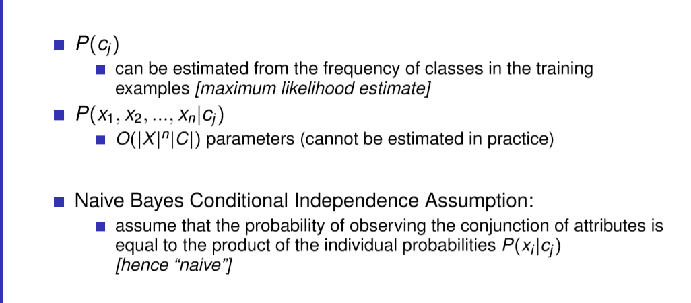 
>NB is very simple to build, extremly fast to make decisions, and easy to change the probabilities when the new data becomes available  
>Works well in many application areas  
>Scales easily for large number of dimensions and data sizes  
>Easy to explain the reason for the decision made  
>One should apply NB first before launching into more sophisticated classification techniques

---

**Support Vector Machines**

*Large Margin Classifiers*  
>Find hyperplane maximises the margin  
>Margin: sum of shortest distances from the planes to the positive/negative samples  

*Hard Margin*  
>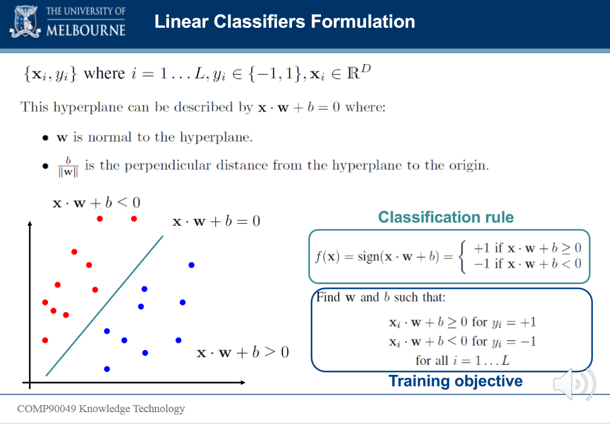  
>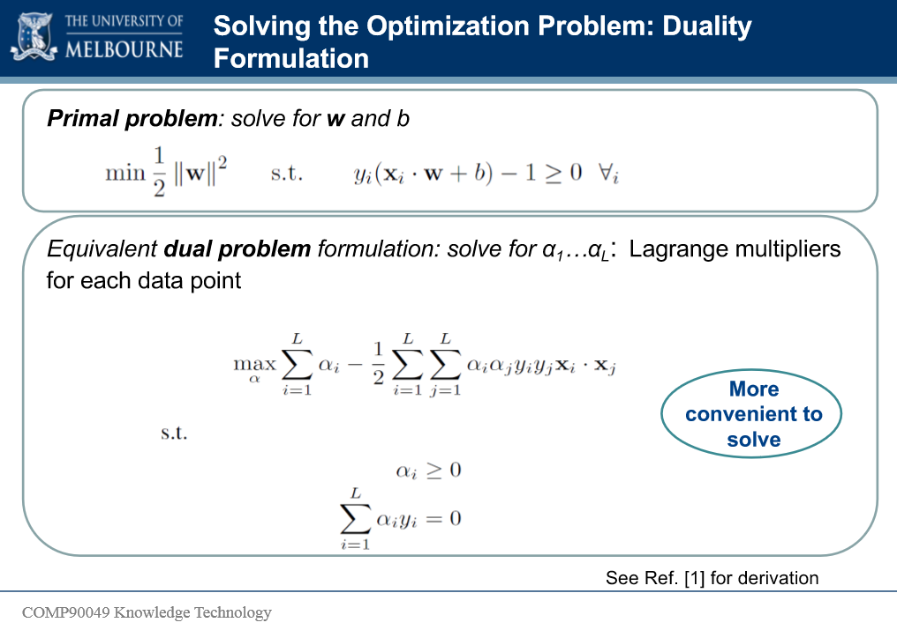  
>  

*Two ways to solve non-linearly data* 
>Soft Margin: Slack variables can be added to allow misclassification of difficult or noisy examples, resulting margin called soft.  
>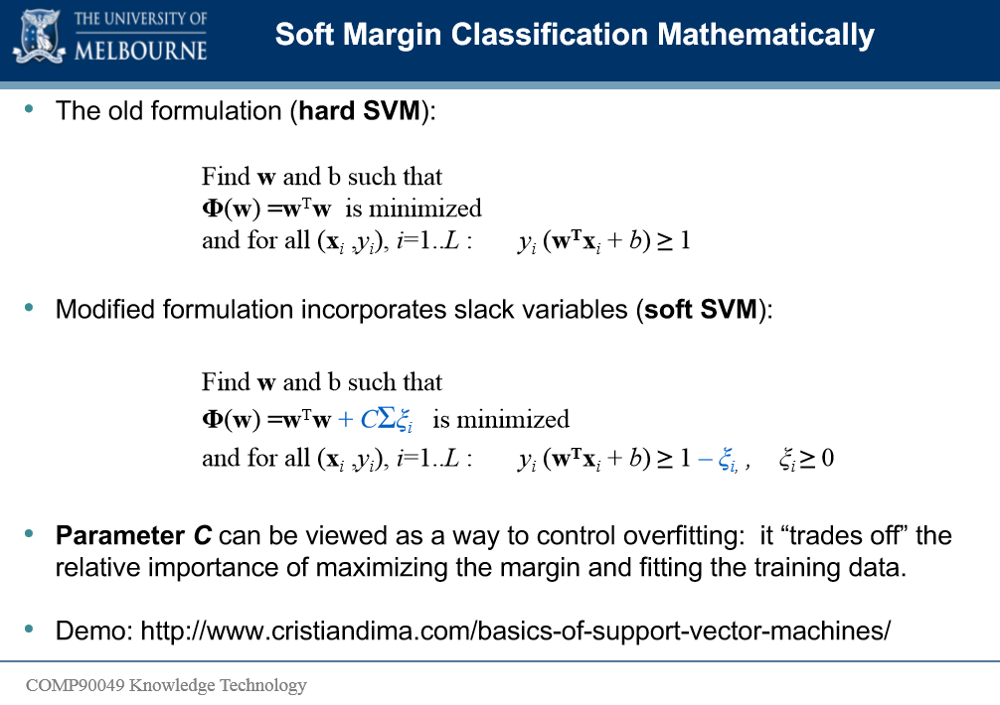  
>Kernel Functions: implicitly maps data into a high-dimensional space, which can be solved by SVM

---

**Feature Selection**

*How to do Machine Learning*  
>Pick a feature representation  
>Compile data  
>Pick a algorithm for building a model  
>Train the model  
>Classify development data, evaluate results  
>go to first  

*Goal*  
>Choose attributes suitable for classifying the data according to the model  

*Wrapper*  
>Choose subset of attributes that give best performance on the development data  
>Pro: feature set with optimal perfomance on development data  
>Con: takes a long time  

*Greedy*  
>Train and evaluate model on each single attribute  
>Choose best attribute  
>Until convergence:  
>>Train and evaluate model on best attributes, plus each remaining single attribute  
>> Choose best attribute out of the remaining set 
> 
>Iterate until performance stops increasing  
>pro:in practice, converges much more quickly 
>cons: take m^2 /2 cycles, may be a sub-optimal solution

*Ablation*
>Start with all attributes  
>Remove one attribute, train and evaluate model  
>Pro: mostly removes irrelevant attributes 
>cons: assumes independence of attributes, actually take m^2 time, slow 

*Embedded*
> Some models actually perform feature selection as part of the algorithm (decision tree)  

*Feature filtering*  
>Intuition: possible to evaluate "goodness" of each feature, separate from other features  
>Consider each feature separately: linear time in number of attributes  
>Typically most popular strategy  
>Possible to control for inter-dependence of features  

*PMI(Point Mutual Information)*  
>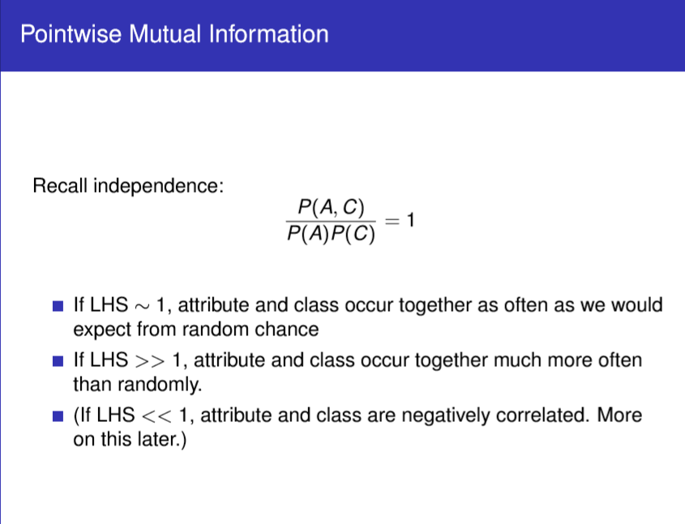  
> 

*What makes a single feature good*  
>Well correlated with class  
>Reverse correlated with class  
>Well correlated with not class  

*MI*  
>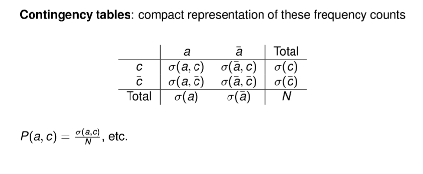 
> 
>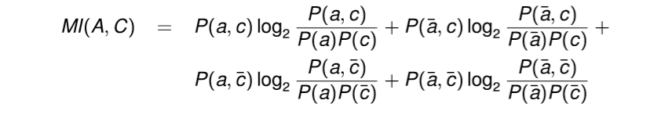 

*Chi-square*  
>Check the value we actually observed O(W) with the expected value E(W)  
>far from the expect means better  
>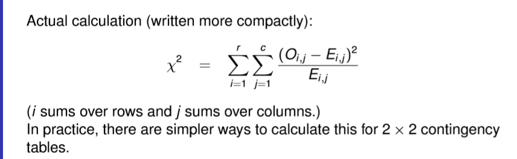 

*Nominal attributes*
>Treat as multiple Binary attributes  
>Modify contigency tables

*Continuous attributes (no exam)*
>usually dealt with by estimating probability based on a Gaussian distibution  
>With a large number of values, most random variables are nomally distibuted due to the Central Limit Theorem  
>For small data sets or pathological features, we typically need to use messy binomial/multinomial distributions  

*Ordinal attributs*  
>Treat as binary  
>Treat as nominal (throw away ordering)  
>Treat as continuous  

*Multi-Class problem*  
>PMI, MI, Chi-square are all calculated per-class  
>Need to make a point of selecting features for each class to give our classifier the best chance of predicting everything correctly  

*Practical considerations*  
>MI is biased toward rare, uninformative features

---

**Decision Tree and Random Forest**  

*Decision Tree*
>Greedy approach: nodes with homogeneous class distribution are preferred

*Measures of Node Impurity*
>Misclassification Error: Error(t) = 1 - maxP(i|t)   
>Entropy(t) = -Σp(j|t)lpgp(j|t)  
>GINI: GINI(t)= 1-Σ[p(j|t)]^2  

*How good is a Split*
>biggest impurity change: I(parent)-ΣN(vj)I(vj)/N

*Decision Tree Parameters*
>Total number of nodes  
>Tree depth  
>Minimum number of data points for a split

*Random Forest*
>Train multiple decision trees on random subsets of samples  
>Decision via majority voting  
>Tree bagging: subset of records  
>Random subspace: subset of features

---  

**Recommendation System**  

*Goal*
>Relevant: Users are more likely to consume items they find Relevance  
>Novelty: Recommender systems are truly helpful when the recommended item is something that the user has not seen in the past  
>Serendipity: the items recommended are somewhat unexpected  
>Increasing recommendation diversity: Diversity has the benefit of ensuring that the user dose not get bored by repeated recommendation of similar items  

*Content-based recommendation*  
>Suitable for text-based products  
>Items are described by their features  
>Users are described by the keywords in the items they brought  
>Recommendations based on the match between the content and user keywords  
>Similarity Measurements: cosine  
>Pro: can recommend new items  
>Con: Feature extraction can be difficult(music, movies)  

*Collaborative filtering*
>The task of predicting user preferences on new items by collecting taste information from many users  
>User-based models: Similar users have similar ratings on the same item  
>Item-based models: Similar items are rated in a similar way by the same user.  
>Explicit opinion: rating score  
>Implicit: purchase records or listen to tracks  

*User based collaborative filtering*
>Identify set of items rated by the target user  
>Identify which ohter users rated 1+ items in this set  
>Compute how similar each neighbor is to the target user   
>Select k most similar neighbors  
>Predict rating for the target user's unrated items (prediction function)
>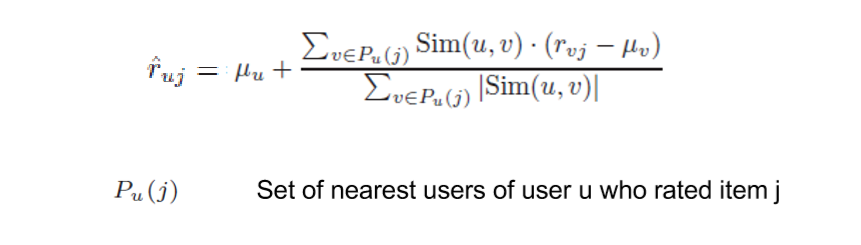 
>Recommend to the user the top N products based on predicted rating

*User similarity pearson correlation*  
>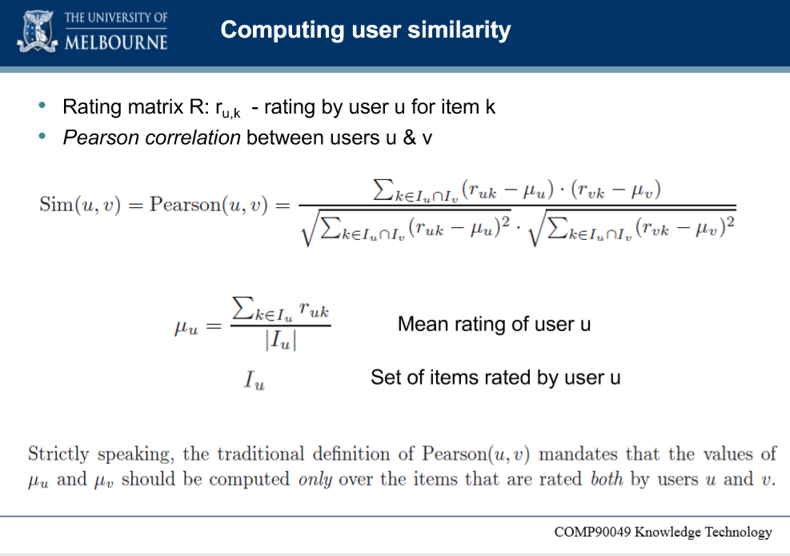 

*Item baased collaborative filtering*
>Identify set of users who rated the target item i  
>Identify which other items were rated  
>Compute similarity between each nighbour and target item  
>Select k most similar neighbours  
>Predict ratings for the target item  
>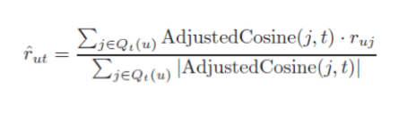 

*Similarity measure*
>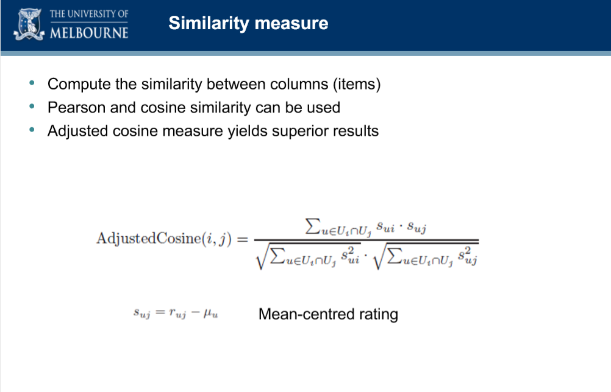 

*Challenges*  
>Many items to choose from  
>Vary few recommendations to propose  
>Few data per user  
>No data for new user  
>Very large datasets

*Performance*  
>Bottlneck: similarity computation  
>Time complexity, highly time consuming with millions of users and items in the database  
>Two step process: 
>>Offline components/model: Similarity computation precomputed and stored  
>>Online component: prediction on process

---

**Association Rules**

*Association Rule Mining*
>Given a set of transactions, find rules that will predict the occurrence of an item based on the occurrences of other items in the transaction  

*Goal*
>Anticipate the nature of repairs on its comsumer products    
>Keep the service vehicles equipped with right parts to reduce the number of visits required by consumer households, and  
>Offer gppd customers service

*Approch*
>Process the data on tools and parts required in previous repairs at different consumer locations, and  
>Discover the co-occurrence patterns

*Itemset*
>A collection of one or more items  
>k-itemset: an itemset that contains k items 

*Support count*
>Frequency of occurrence of an itemset  

*Support*
>Fraction of transactions that contain an itemset  

*Frequent Itemset*
>An itemset whose support is greater than or equal to a minsup threshold

*Association Rule*
>An implication expression of the form A->B, where A and B are itemsets: A,antecedent, B, consequent

*Support and Confidence*
>Support: fraction of trasactions that contain both A and B   
>Confidence: measures how often items in A appear in transaction that contain B  
>Example:
>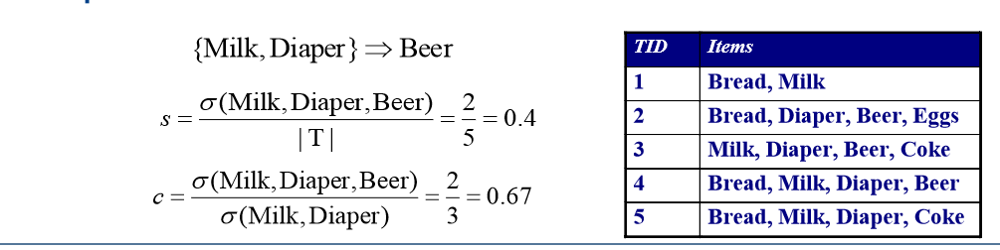 

*Association Rule Mining Task*
>Support >= minsup threshold  
>Confidence >= minconf threshold

*Brute-force approch*
>List all possible association rules  
>Compute the support and confidence for each rule  
>Prune rules that fail the minsup and minconf thresholds  
>Computationally prohibitive

*Two-step approach*
>Frequent Itemset Generation (still expensive)
>Rule Generation

*Apriori principle (do questions)*
>if an itemset is frequent, then all of its subsets must also be frequent 
>confidence of rules generated from the same itemset has an anti-monotone property c(ABC->D)>=c(AB->CD)

*Hash Tree (try to understand)*

*Limitations of Association Rules*
>Only applicable to nominal attributes  
>Comprehensibility of association rules  
>Rule redundance  
>Need for secondary evaluation of genuine interestingness of the rule  
>Are the association rules what we want  

*Classified*
>useful: high quality, actionable information  
>trivial: already known to anyone familiar with the context  
>inexplicable: this which have no apparent explanation

---

**Neural Networks**

*Benefits of Deep learning*
>Robust: No need to design the features ahead of time - features are automatically learned to be optimal for the task at hand  
>Robustness to natural variations in the data is automatically learned  
>Generalizable: the same neural net approach can be used for many different applications and data types  
>Scalable: performance improves with more data, method is massively parallelizable  

*Artificial Neural Networks*
>A collection of simple, trainable mathmatical units that collectively learn complex functions  
>Given sufficient training data an artificial neural network can approximate very complex functions mapping raw data to output decisions 

*Types of Deep Neural Networks*
>DNN - all fully connected layers  
>CNN(convolution Neural Networks) - some convolutional layers  
>RNN(recurrent neural network) - LSTM  

*Fundamentals of Neural Networks*  
>Receive signals from input neurons: x1,x2,...,xn  
>Weight signals according to the link strength between neurons: w1x1,w2x2,...,wnxn  
>Add the input signals and bias:Σwixi+b  
>Emit an output signal: activation function f 

*Activation Functions*  
>Activation functions add non-linearity to our networks's function  
>Most real-world problems + data are non-linear  

*Training a Network*
>Find a set of weights so that the network exhibits the desired behaviour  

*Error Function*
>Measure the difference between actual output and expected output  
>One popular measure: sum of squared error: E(input,weight,lable)= Σ(output-label)^2  
>Note: Neural network is a composite/nested function that map the input to the output

Obective:finding the weights w that minimise the difference between t and o for each of our training inputs

back-propagation algorithm

We repeatedly update the weights based on each example untile the weights converge

*Adjusting Learning Rate*
>Learning rate parameter is a small value to control the update of weights in a stable manner

Please see workshop

---
Author: chuaan